# MeiliSearch介绍

MeiliSearch 技术文档 简介 MeiliSearch 是一个开源的全文搜索引擎，旨在提供快速、可靠的搜索体验。它是用 Rust 编写的，具有高性能和可扩展性。

安装 MeiliSearch 可以通过以下几种方式进行安装：

1. 使用预编译的二进制文件 可以从 MeiliSearch 的官方网站下载预编译的二进制文件，并按照官方文档中的指示进行安装。

2. 使用 Docker MeiliSearch 也提供了 Docker 镜像，可以通过 Docker Hub 进行下载和安装。详细的安装步骤请参考官方文档。

3. 自行编译源代码 如果需要自定义配置或者对源代码进行修改，可以从 MeiliSearch 的 GitHub 仓库中获取源代码，并按照官方文档中的指示进行编译和安装。

高级特性 除了基本的搜索功能，MeiliSearch 还提供了一些高级特性，包括：

自定义排名和过滤规则 同义词支持 多语言支持 分布式部署和负载均衡 详细的使用方法和配置说明请参考官方文档。

总结 MeiliSearch 是一个功能强大且易于使用的全文搜索引擎，适用于各种应用场景。通过本文档，您可以了解到如何安装、配置和使用 MeiliSearch，并了解一些高级特性。希望本文档对您有所帮助！

# 安装及搭建注意事项
官方提供方式很多。而我使用的是Curl与Docker方式进行安装。安装方式如下：

参考地址：https://github.com/meilisearch/meilisearch-php
参考地址：https://www.meilisearch.com/docs

1、通过Composer安装meilisearch类库
```
composer require meilisearch/meilisearch-php
```
2、客户端类库

注意客户端对类库的版本是有要求的,需要根据自己的meilisearch版本进行选择
 
```
composer require  guzzlehttp/guzzle
```

3、安装运行meilisearch

终端运行命令
```
#Install Meilisearch
curl -L https://install.meilisearch.com | sh

# Launch Meilisearch
./meilisearch --master-key=masterKey
```

Docker运行命令
```
docker run -itd -p 7700:7700 -v /www/wwwroot/meilisearch/data:/meili_data getmeili/meilisearch meilisearch --master-key="yqHjxKmbAvtaBih9YFe3XJQPVGoO8wL4"
```

测试是否安装成功
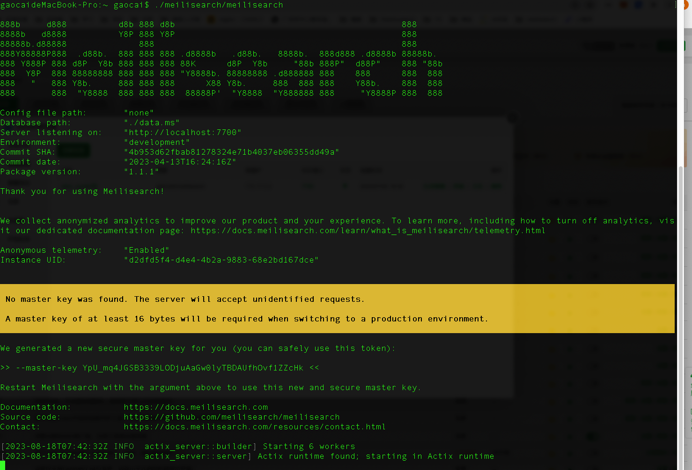
访问图中地址：http://localhost:7700

# 使用方式
官方提供方式很多，而我使用的是Curl与PHP方式,主要侧重介绍PHP类库使用方式。使用方式如下：

### 1、命令行通过API形式使用。例如：
添加文档
```
curl \
  -X POST 'http://localhost:7700/indexes/movies/documents?primaryKey=id' \
  -H 'Content-Type: application/json' \
  -H 'Authorization: Bearer aSampleMasterKey' \
  --data-binary @movies.json
```
新开终端（注意是新开终端，要保证meilisearch服务常驻），添加文档后（演示）:
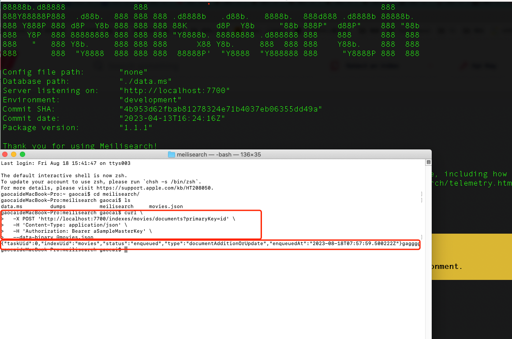
返回添加任务后的任务ID，这个时候去到客户这个时候刷新客户端，就可以看到添加的文档：


剩下的就是界面化操作，进行搜索数据了。可以自行尝试。
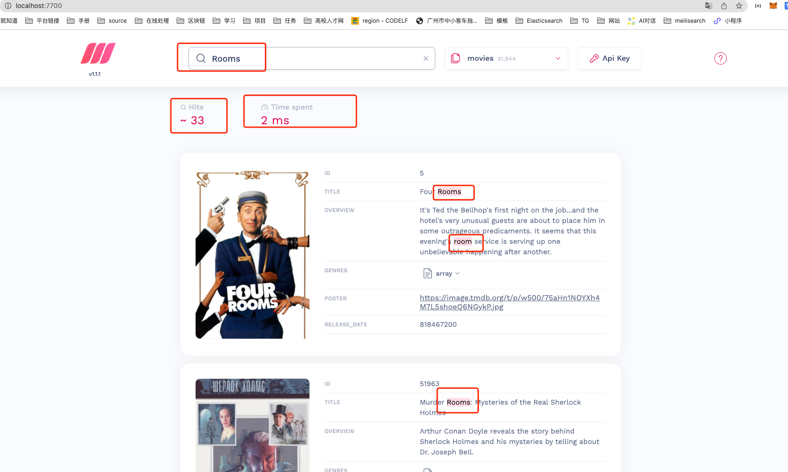

关注的重点就是拆词搜索与搜索返回时间，这个是meilisearch的特色之一。
同时也可以设置客户端请求的秘钥即API KEY，这样就可以保证数据安全性。在运行客用户端服务时候设置参数master-key即可。

演示：
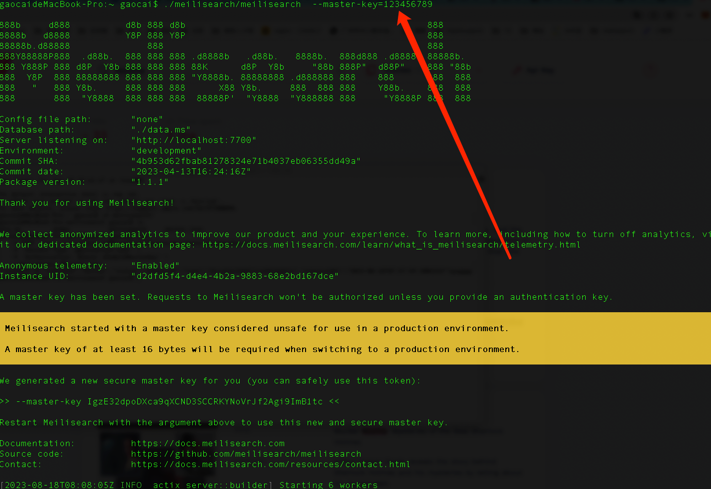

API KEY填错了，就会报错：
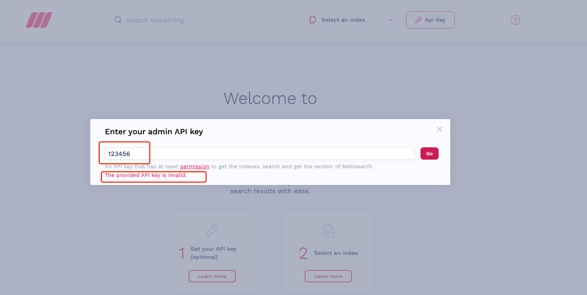
API KEY填写正确，就可以正常访问：
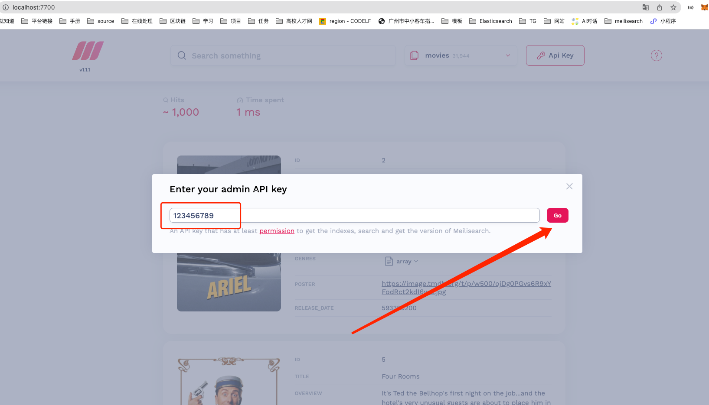
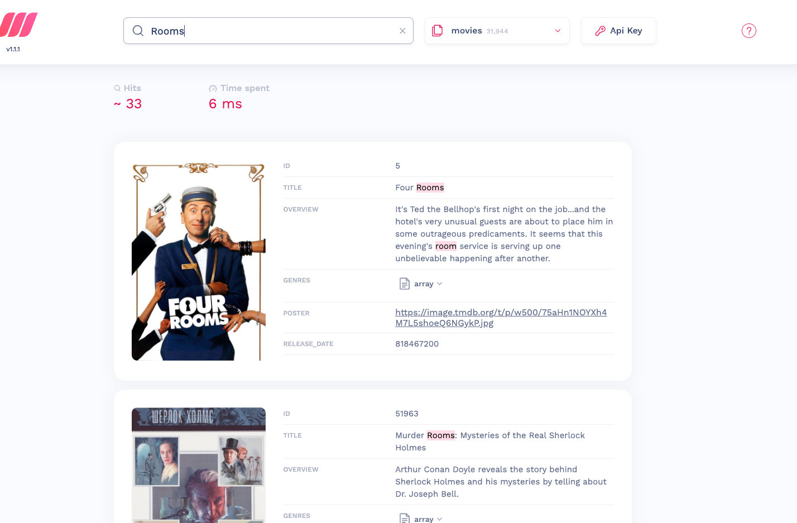

### **<div style="color:red;">2、PHP类库使用方式（重点介绍）<div>**
使用方法文档地址1：https://php-sdk.meilisearch.com/classes/Meilisearch-Endpoints-Delegates-HandlesDocuments.html#method_getDocument

使用方法文档地址2(参考)：https://www.meilisearch.com/docs/reference/api/overview

**前提：安装好meilisearch服务，安装好meilisearch-php类库，然后启动meilisearch服务常驻**
本地演示(可以设置API KEY)：
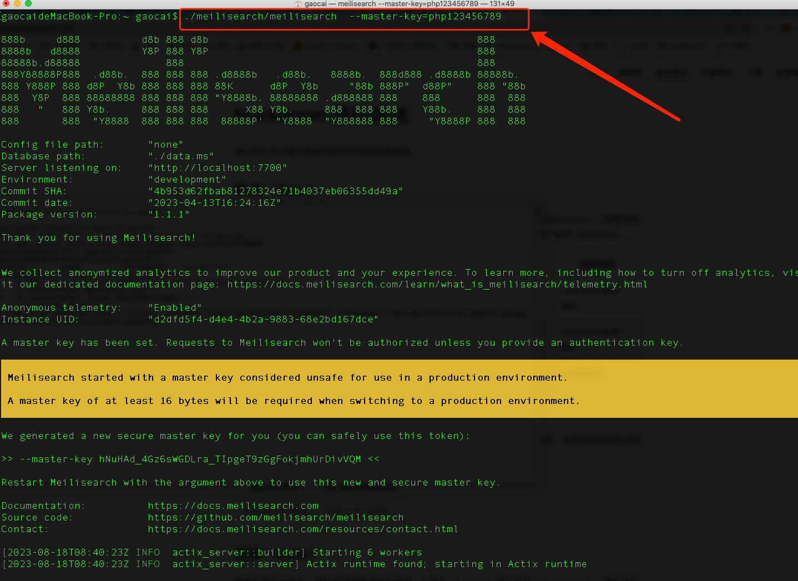
本地服务启动成功（这里我演示设置了API KEY，不需要可去掉），进入代码演示：

我的测试API KEY：php123456789

#### 1、准备工作
```
    //链接客户端
    $client = new Client('http://localhost:7700', 'php123456789');
    //设置文档的索引名称
    $index = $client->index('php_job_001');
    //获取职位数据
    $data = BaseJob::find()
    ->alias('j')
    ->select([
    'j.id',
    'j.name as jobName',
    'a.title as announcementName',
    'c.full_name as companyName',
    ])
    ->leftJoin(['a' => BaseAnnouncement::tableName()], 'a . id = j . announcement_id')
    ->leftJoin(['c' => BaseCompany::tableName()], 'c . id = j . company_id')
    ->andWhere([
    'j . status' => [
    BaseJob::STATUS_ONLINE,
    BaseJob::STATUS_OFFLINE,
    ],
    ])
    ->orderBy('j . id asc')
    ->asArray()
    ->all();
```
这里php_job_001设置的文档索引key很重要，是后面数据获取的重要依据，这里我设置的是职位数据，所以key是php_job_001，这个key可以自己设置，但是要保证唯一性，不然会报错。

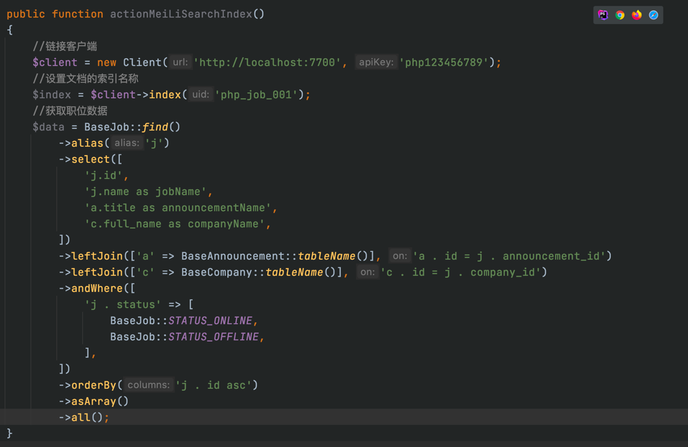
#### 2、添加文档
```
    //添加文档
    $res=$index->addDocuments($data);
    //看看返回
    var_dump($res);
```
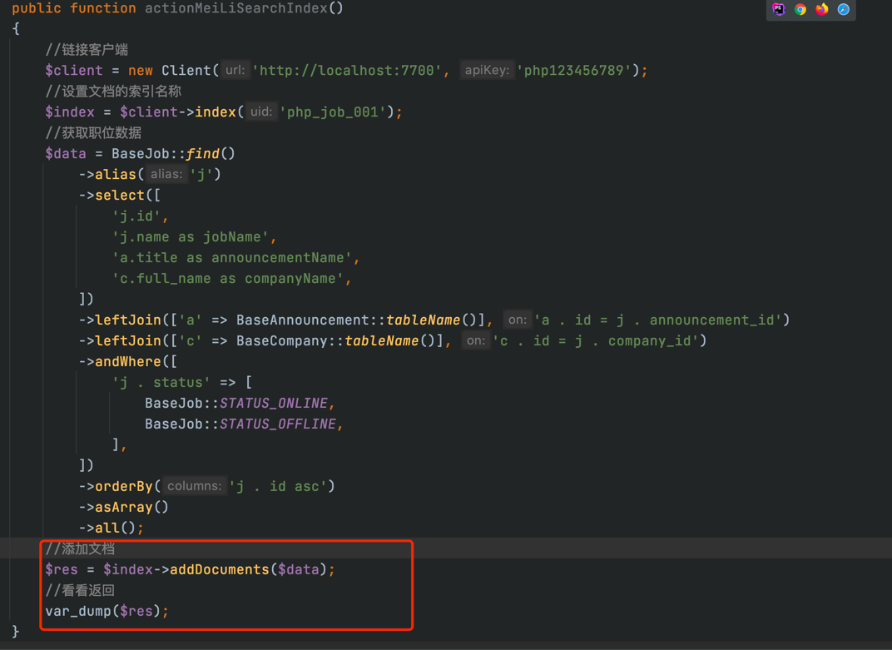
返回内容：
添加文档任务ID，文档key是什么
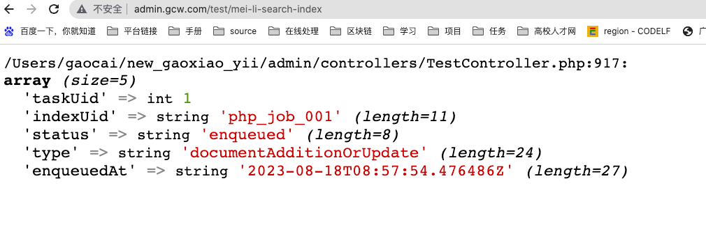
快捷查看就是去客户端（证明文档添加成功）
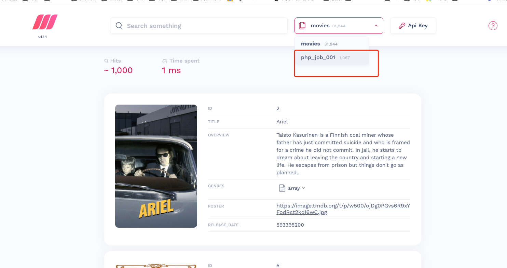
程序实现查看文档添加成功方式有很多举一个例子
直接获取文档内容
#### 3、获取全部或者单条文档内容
```
    //获取单条文档内容
    $res = $index->getDocument(35);
    //获取全部文档内容
    $res = $index->getDocuments();
```
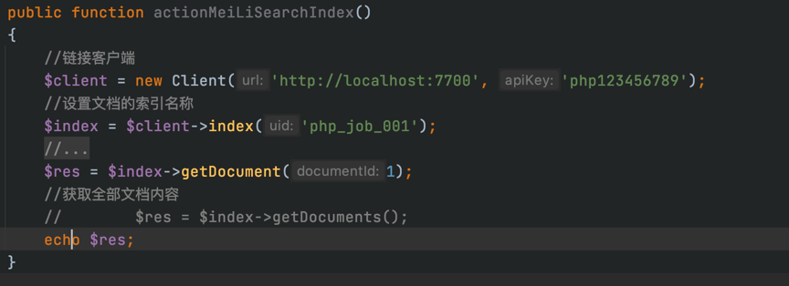
执行结果：

文档单条内容

文档全部内容
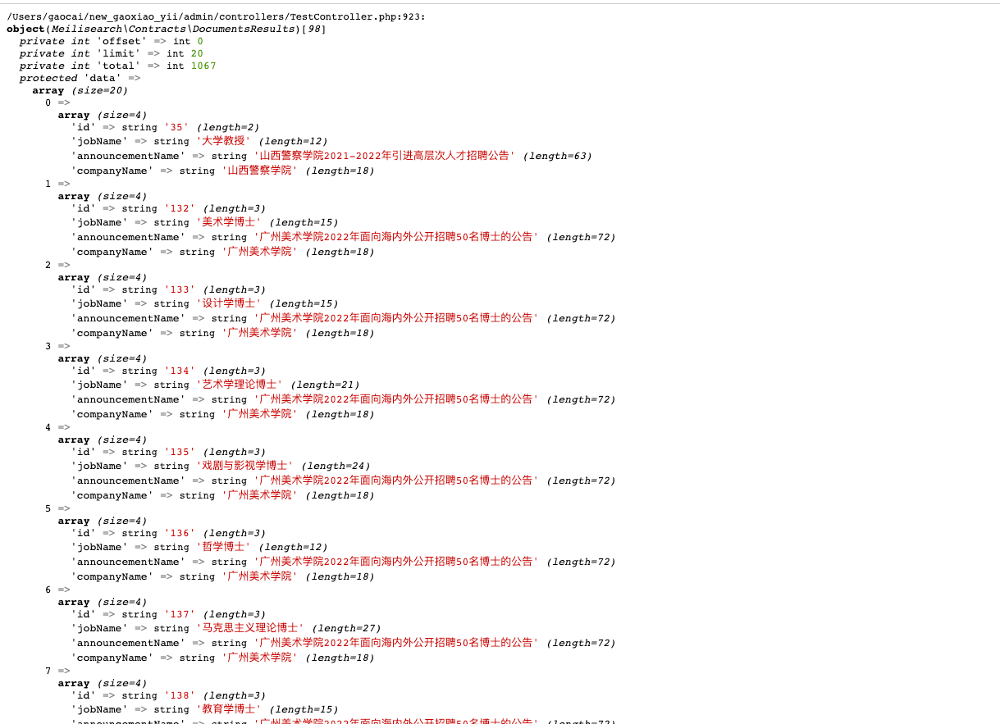

#### 4、查看文档的配置信息
```
    //查看php_job_001这个文档的独立配置
    $res = $index->getSettings();
```
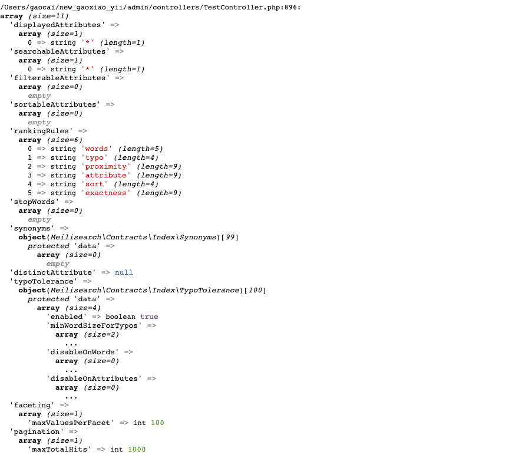

使用方法与获取文档内容类似，其他的<span style="color:red;">简单方法</span>使用方式可以参考官方文档，这里就不一一介绍了。都是一些连贯式操作，找到准确的方法就能时间线简单操作。

#### 5、实现业务探索
首先文档中可以点滴滴找得到的，这里我只是进行整理一下。
自身业务：职位中心B页面职位名称关键字搜索，要尽可能精确匹配，而且需要提高搜索效率与性能。

    ①、什么是文档配置？
    每一个文档索引都有自己的配置，可以通过配置来实现业务要求，根据自身的要求针对对应的文档索引进行配置，来实现文档索引的业务要求。
    
    ②、如何使用文档配置达到业务要求？
    这里我设置了主键、允许搜索字段、采用拆词全匹配来实现业务需求。

    ③、meilisearch默认会拆词进行匹配数据，如何实现精确匹配？
    演示：
        <设置主键>
        $index = $client->index('php_job_001');
        $index->addDocuments($data,'jobId');//设置职位ID为主键
        <设置允许搜索字段>
        $index->updateSearchableAttributes([
            'jobName',//只允许搜索职位名称字段
        ]);
        <搜索拆词全匹配>
         $search = $index->search('北京教师', [
            'matchingStrategy' => 'all',//拆词全匹配
        ]);


    


